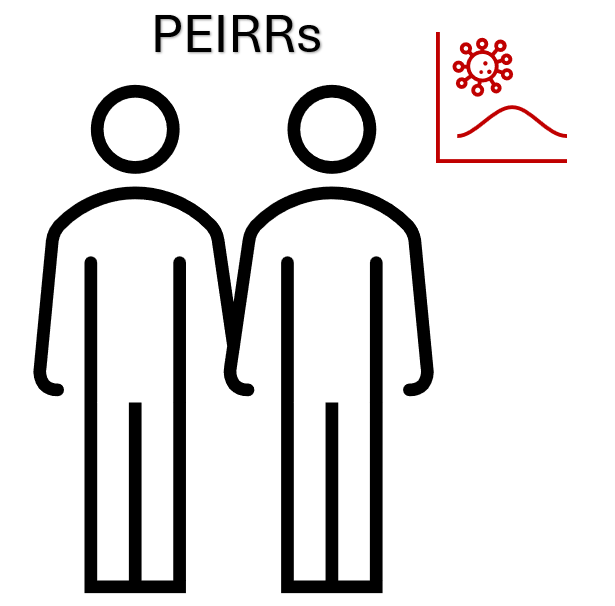

# Pair-based Estimators of Infection and Removal Rates

[](http://creativecommons.org/publicdomain/zero/1.0/)



## Install

**From PyPI (recommended)**

```bash
pip install peirrs
```

**From source (development)**

Install from the local source directory using pip:

```bash
pip install -e .
```

Requires NumPy and SciPy for numerical computations.

## Requirements

This package requires Python 3.6+ with the following dependencies:
- NumPy 1.19+
- SciPy 1.5+

I developed the package with versions:
- Python 3.9+
- NumPy 1.21+
- SciPy 1.7+

## Usage

Estimate infection and removal rates with partially observed removal and infection times. The following functions are the ones you would likely use, in order of relevance:

**Real data analysis**
- `peirrs.estimators.peirr_tau()` - EM-based estimation
- `peirrs.estimators.peirr_bayes()` - Bayesian estimation with MCMC
- `peirrs.estimators.peirr_bootstrap()` - Bootstrap resampling
- `peirrs.estimators.peirr_imputed()` - Imputation-based estimation

**Simulation experiments**
- `peirrs.simulate.simulator()` - Core simulation wrapper

All functions have docstrings. As a result, you can get help for instance with:
```python
from peirrs.estimators import peirr_tau
help(peirr_tau)
print(peirr_tau.__doc__)
```

There are also functions with the suffixes `_multitype()` and `_spatial()` for estimators with multiple classes and spatial kernels, respectively:

**Multitype estimators** (in `peirrs.multitype.estimators_multitype`)
- `peirr_tau_multitype()` - Class-specific EM estimation
- `peirr_bayes_multitype()` - Class-specific Bayesian MCMC
- `peirr_bootstrap_multitype()` - Class-specific bootstrap

**Spatial tools** (in `peirrs.spatial`)
- `peirr_tau_spatial()` - Spatial EM estimation
- `peirr_bayes_spatial()` - Spatial Bayesian MCMC
- `simulate_distance_matrix()` - Generate spatial distance matrices
- `simulator_spatial()` - Spatial simulation wrapper

The `peirr_bootstrap()` function does not provide confidence intervals but rather bootstrap samples. You can perform bias correction or interval estimation according to [Wikipedia](https://en.wikipedia.org/wiki/Bootstrapping_(statistics)#Deriving_confidence_intervals_from_the_bootstrap_distribution).

**Warning**
- I used AI chatbots to translate this from an R package.
    - Mostly as a personal experiment ...
- PBLA functions are not available.
- Some light units tests are available.
    - Except for complete data, the `_bayes` functions are barely tested.
- Some spot reading resulted in:
    - Manually fixes to the `utils.tau_moment` function
    - Manually fixed to the `_bayes` functions
- I checked that some simulation study results were similar.
- I checked for sensible results in small IPython notebook.